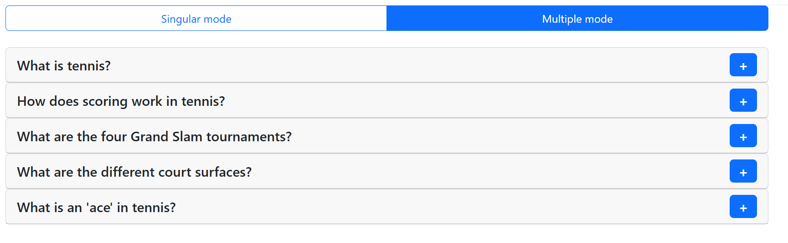

## Tennis FAQ Accordion

A simple and reusable **Accordion component** built with **React**, **TypeScript**, and **Bootstrap**.  
This project demonstrates how to manage state, component structure, props, and UI interactions while integrating Bootstrap’s styling utilities for quick and responsive design.

The accordion allows users to expand or collapse panels, making it ideal for FAQs, menus, or any UI pattern requiring collapsible content sections.

## Features

- Expand / collapse sections on click
- Fully reusable Accordion component
- Strongly typed with **TypeScript**
- Uses **Bootstrap** for styling and layout
- Clean component structure
- Supports multiple accordion items
- Accessible and responsive design

## Tech Stack

- **React.js**
- **TypeScript**
- **Bootstrap 5** (styling and layout)
- React Hooks (`useState`)
- Vite

## Quick Start

```bash
git clone https://github.com/adrianmarceloledesma/Accordion
cd Accordion
npm install
npm run dev
```

## Live Demo

https://accordionargentina.netlify.app/

## Preview



## What I learned

- Building reusable UI components
- Managing local state in React
- Passing and typing props with TypeScript
- Integrating Bootstrap into React applications
- Organizing components in a clean and scalable structure
- Designing simple and responsive UI patterns
